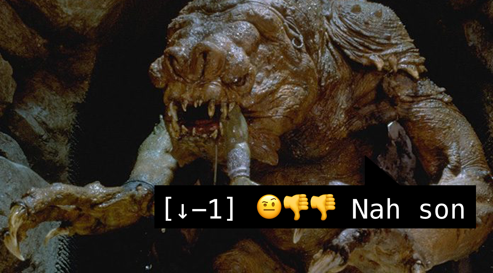
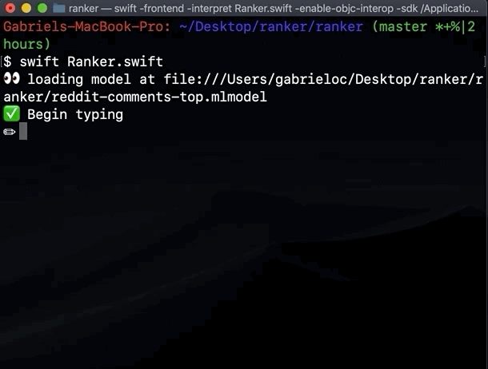

# COMMENT RANKER



A tool for determining how high your Reddit comment will score using machine learning. To run, simply call

```
$ swift Ranker.swift
```

The script fetches 100 posts from `top`, and up to 500 comments per post. It stores comment text and score then uses that to train an `MLTextClassifier`. Training takes about a minute the first time around, but is cached for subsequent runs.

If you have any questions, hmu [@_gabrieloc](https://twitter.com/_GABRIELOC).



